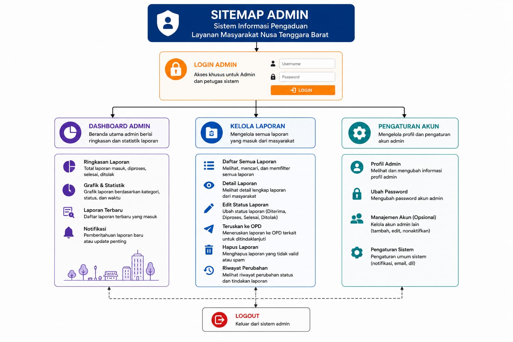
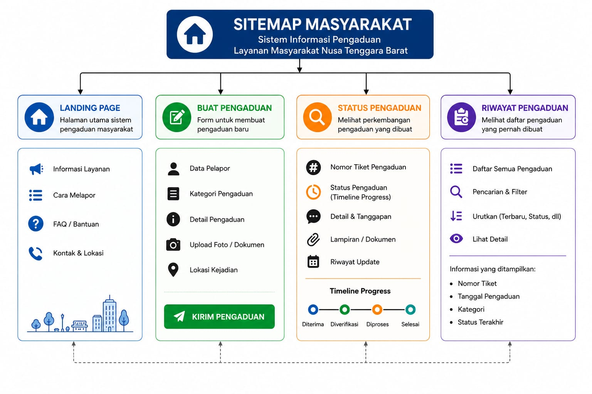
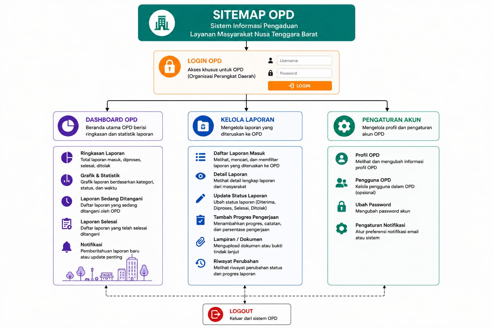
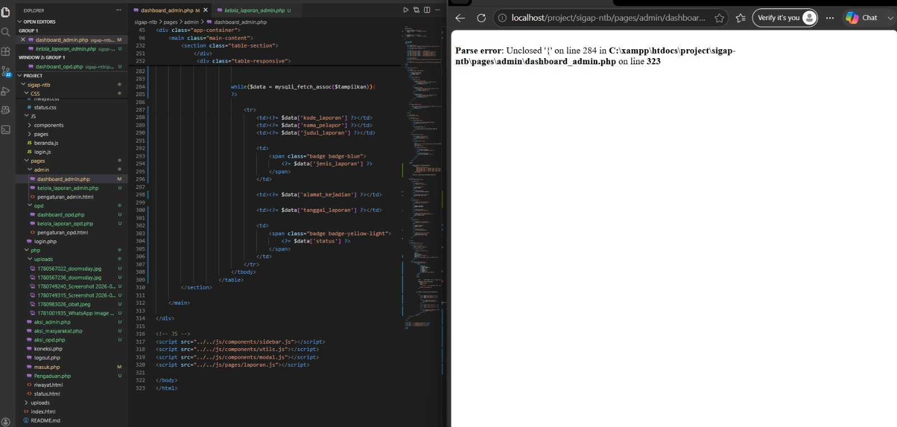
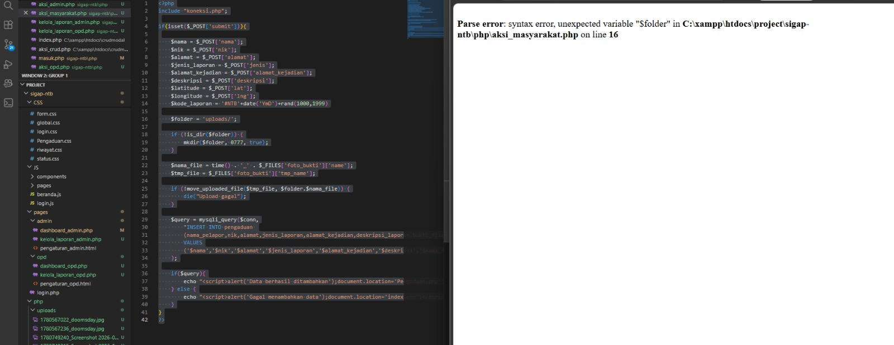
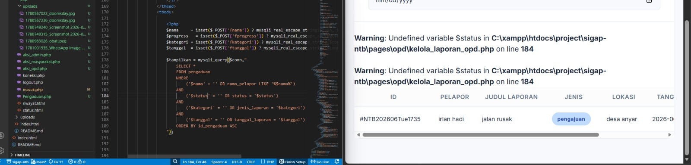

## Website Name
# SIGAP NTB — Sistem Informasi Gerakan Aspirasi Publik NTB

---

# Short Description
SIGAP NTB adalah sebuah platform digital berbasis web yang berfungsi sebagai sistem pelaporan, pengaduan, dan pengajuan terkait kerusakan fasilitas umum maupun permasalahan sosial di wilayah Nusa Tenggara Barat (NTB). Sistem ini dirancang untuk menggantikan proses pelaporan semi-manual yang rentan miskomunikasi, kurang terstruktur, dan tidak transparan. SIGAP NTB hadir dengan menyediakan sistem yang terintegrasi dan digital untuk meningkatkan efisiensi, transparansi, dan akuntabilitas dalam penanganan pengaduan masyarakat.

---

## 🎯 Project Goals
* **Mempermudah Masyarakat:** Memfasilitasi warga NTB dalam membuat pengaduan dan pengajuan perbaikan fasilitas umum tanpa hambatan birokrasi atau kewajiban login.
* **Meningkatkan Transparansi:** Memberikan akses terbuka bagi masyarakat untuk memantau status, respons, dan riwayat penyelesaian laporan secara *real-time*.
* **Efisiensi Kerja Admin:** Menyediakan sistem manajemen yang sistematis bagi admin untuk memvalidasi, menyaring, dan meneruskan laporan secara instan.
* **Otomatisasi & Optimalisasi OPD:** Memudahkan Organisasi Perangkat Daerah (OPD) dalam menerima, mengelola, dan memperbarui progres penanganan laporan yang menjadi tanggung jawabnya.
* **Sinergi Tepat Sasaran:** Meningkatkan koordinasi antar-lembaga sehingga penanganan keluhan publik menjadi lebih cepat dan terukur.

---

# Team Members & Responsibilities

| Nama | NIM | Role | Responsibilities |
|------|------|------|------|
| Nazril Hidayat | F1D02410007 | Fullstack Developer | Frontend: Membuat UI Form Pengaduan Masyarakat, Halaman Cek Status Laporan, dan Halaman Riwayat Laporan.Backend: Membuat logika insert data laporan baru ke database (beserta upload foto) dan query pencarian data untuk menampilkan status/riwayat ke publik. |
| Irlan Hadi | F1D02410058 | Fullstack Developer | Frontend: Membuat desain UI Form Login. Backend (Dominan): Mengembangkan sistem Autentikasi (Sesi login, enkripsi password, logout), Otorisasi Hak Akses (membedakan view Admin dan OPD), logika utama perubahan status laporan (Verifikasi Admin & Update Progres OPD), serta bertindak sebagai Arsitek Database (merancang struktur dan relasi tabel keseluruhan). |
| Muhammad Ravi Rayvansyah | F1D02410078 | Fullstack Developer | Frontend: Membangun antarmuka Dashboard Admin, Dashboard OPD, dan tabel interaktif untuk manajemen laporan.Backend: Membuat query untuk menampilkan statistik data di dashboard (jumlah laporan masuk, selesai, dll), serta logika untuk menampilkan daftar laporan berdasarkan OPD terkait. |

---

# Project Structure

```
├── Assets
│   ├── images
│   │   ├── desa.png
│   │   ├── kecamatan.png
│   │   ├── kota.png
│   │   ├── lingkungan.jpeg
│   │   ├── logo-ntb.png
│   │   └── mataram.webp
│   ├── buglog1.png
│   ├── buglog2.png
│   └── buglog3.png
├── CSS
│   ├── components
│   │   ├── button.css
│   │   ├── card.css
│   │   ├── chart.css
│   │   ├── modal.css
│   │   ├── sidebar.css
│   │   ├── table.css
│   │   ├── toast.css
│   │   └── topbar.css
│   ├── admin.css
│   ├── beranda.css
│   ├── form.css
│   ├── global.css
│   ├── login.css
│   ├── pengaduan.css
│   ├── riwayat.css
│   └── status.css
├── JS
│   ├── components
│   │   ├── modal.js
│   │   ├── sidebar.js
│   │   └── utils.js
│   ├── pages
│   │   ├── dashboard_admin.js
│   │   ├── laporan.js
│   │   ├── profil.js
│   │   └── user.js
│   ├── beranda.js
│   └── login.js
├── pages
│   ├── admin
│   │   ├── dashboard_admin.php
│   │   ├── kelola_laporan_admin.php
│   │   └── pengaturan_admin.php
│   ├── opd
│   │   ├── dashboard_opd.php
│   │   ├── kelola_laporan_opd.php
│   │   └── pengaturan_opd.php
│   └── login.php
├── php
│   ├── uploads
│   │   ├── 1781924878_a0270213cedf8055.png
│   │   ├── 1781931390_9aa0e4251bd5b6c0.png
│   │   ├── 1781943847_6a15beffaefef30e.png
│   │   ├── 1782148973_be9dfd3a97500ca5.jpg
│   │   └── 1782150125_a59b519d0769a489.jpg
│   ├── aksi_admin.php
│   ├── aksi_masyarakat.php
│   ├── aksi_opd.php
│   ├── koneksi.php
│   ├── logout.php
│   ├── masuk.php
│   ├── pengaduan.php
│   ├── riwayat.php
│   └── status.php
├── index.php
├── migrate_password.php
├── README.md
└── sigap_ntb.sql
```

# Sitemap
 
 


# Website Users / Actors
### 1. Masyarakat 
Aktor publik yang dapat mengakses sistem secara langsung tanpa perlu melakukan proses registrasi atau login untuk menjaga fleksibilitas dan kecepatan pelaporan.
* **Sitemap / Menu:**
  * 🏠 `/` (Landing Page) : Informasi umum sistem, alur pengaduan, dan ringkasan statistik global laporan.
  * 📝 `/buat-laporan` : Form pengaduan masyarakat (Input: NIK, Nama, Alamat, Judul, Kategori, Deskripsi, Koordinat Lokasi, Wilayah, & Upload Foto Bukti).
  * 🔍 `/cek-status` : Fitur pencarian dan pelacakan status pengaduan yang sedang berjalan menggunakan kode laporan secara transparan.
  * 📜 `/cek-riwayat` : Halaman yang memuat daftar riwayat seluruh laporan masyarakat yang telah selesai ditangani sebagai bentuk akuntabilitas publik.

### 2. Admin
Aktor internal yang bertanggung jawab penuh atas validasi awal laporan masyarakat sebelum diteruskan ke instansi OPD terkait.
* **Sitemap / Menu:**
  * 🔐 `/login` : Gerbang masuk autentikasi petugas (*role*: admin).
  * 📊 `/admin/dashboard` : Panel statistik utama menampilkan metrik ringkasan jumlah laporan (*Menunggu, Disetujui, Ditolak*).
  * 📋 `/admin/kelola-laporan` : Halaman manajemen berkas masuk dengan hak akses untuk melakukan **edit**, **hapus**, serta **meneruskan** laporan yang valid ke OPD terkait (mengubah status laporan hingga tahap *terverifikasi* / diteruskan).
  * ⚙️ `/admin/pengaturan-akun` : Halaman khusus bagi Admin untuk memperbarui data profil personal dan kata sandi login.

  ### 3. OPD/Organisasi Perangkat Daerah
Aktor instansi teknis (seperti Dinas PUPR, Dinas Kesehatan, dll.) yang mengeksekusi penanganan masalah langsung di lapangan sesuai wilayah kerjanya.
* **Sitemap / Menu:**
  * 🔐 `/login` : Gerbang masuk autentikasi petugas (*role*: opd).
  * 📊 `/opd/dashboard` : Ringkasan performa penyelesaian tugas khusus untuk instansi terkait.
  * ⚙️ `/opd/kelola-laporan` : Halaman untuk mengelola disposisi laporan dari admin, melakukan **edit** data pengerjaan, serta memperbarui status perkembangan laporan secara berkala hingga tahap **Selesai** (disertai unggahan foto bukti setelah perbaikan).
  * 👤 `/opd/pengaturan-akun` : Halaman bagi petugas OPD untuk memperbarui data profil instansi dan kata sandi login.

---

# Tech Stack

## Frontend
- HTML5
- CSS3
- JavaScript

## Backend
- PHP Native

## Database
- MySQL

## Development Tools
- Visual Studio Code
- XAMPP
- GitHub

# Penggunaan Hashing
## 1. password_hash()
Fungsi ini digunakan hanya sekali, yaitu saat pengguna pertama kali mendaftar atau saat Admin/OPD mengubah kata sandi mereka.
Tujuan: Mengubah teks kata sandi yang mudah ditebak (seperti 123456) menjadi string acak yang kompleks dan tidak dapat dikembalikan ke bentuk asal.
Keunggulan Utama: * Salt Otomatis: Fungsi ini menambahkan salt (potongan karakter acak) ke dalam password secara otomatis setiap kali dipanggil. Artinya, jika ada dua user yang sama-sama menggunakan password rahasia123, hasil hash di database akan tetap berbeda.
Keamanan Bcrypt: Menggunakan algoritma hashing yang sangat lambat secara desain, sehingga peretas akan membutuhkan waktu ribuan tahun jika ingin melakukan brute-force password Anda.

$passwordHash = password_hash($passwordBaru, PASSWORD_DEFAULT);
// Hasilnya disimpan ke database, bukan $passwordBaru.

## password_verify()
Fungsi ini digunakan setiap kali pengguna mencoba untuk masuk (login).
Tujuan: Memeriksa apakah password yang diketikkan di form login sesuai dengan hash yang tersimpan di database.
Mengapa tidak membandingkan langsung ($password == $data['password'])?
Karena password di database sudah dalam bentuk hash acak, sedangkan password dari form login masih dalam bentuk teks biasa. Anda tidak bisa membandingkan keduanya secara langsung.

if(!password_verify($password, $data['password'])){
    // Jika tidak cocok, tolak login
}

## DBMS: Configuration & Table Specification

### 1. Database Configuration
Koneksi database pada skrip PHP Native (`config.php` atau `koneksi.php`) dikonfigurasikan dengan parameter standar lingkungan XAMPP:
```php
<?php
$host     = "localhost";
$username = "root";
$password = "";
$database = "sigap_ntb";

$koneksi  = mysqli_connect($host, $username, $password, $database);

if (!$koneksi) {
    die("Koneksi database gagal: " . mysqli_connect_error());
}
?>
```

---

##  Bug Log & Troubleshooting

### 1. Modul Dashboard Admin (Parse Error: Unclosed '{')

* **Alasan Eror:** Terjadi kesalahan sintaks PHP (*syntax error*) karena kurung kurawal pembuka `{` pada perulangan `while` di baris 284 belum ditutup kembali di bagian akhir blok tabel HTML.
* **Cara Penyelesaian:** Menambahkan kurung kurawal penutup PHP `<?php } ?>` tepat di bawah tag penutup baris tabel `</tr>` atau sebelum tag penutup `</tbody>` agar perulangan data berjalan dengan benar.

### 6. Modul Aksi Masyarakat (Parse Error: Unexpected Variable "$folder")

* **Alasan Eror:** Terjadi *syntax error* karena pada baris 14 di file `aksi_masyarakat.php` lupa diberikan tanda titik koma (`;`) di akhir baris setelah fungsi `rand()`. Hal ini membuat compiler PHP membaca baris berikutnya sebagai *error*.
* **Cara Penyelesaian:** Menambahkan tanda titik koma (`;`) tepat di ujung baris 14 menjadi `$kode_laporan = '#NTB'.date('YmD').rand(1000,1999);` agar baris kode tereksekusi dengan sempurna.

### 7. Modul Kelola Laporan OPD (Warning: Undefined variable $status)

* **Alasan Eror:** Terjadi kesalahan pemanggilan data karena variabel `$status` digunakan di dalam query SQL (baris 184), namun variabel tersebut belum dideklarasikan atau dibuat di bagian atas script PHP. Variabel yang tertera di baris 173 adalah `$progress`.
* **Cara Penyelesaian:** Mengubah nama variabel penampung di baris 173 menjadi `$status = isset($_POST['fprogress']) ? ...` atau menyamakan nama variabel yang dipanggil di dalam query SQL agar sesuai dengan variabel yang dideklarasikan di awal script.


